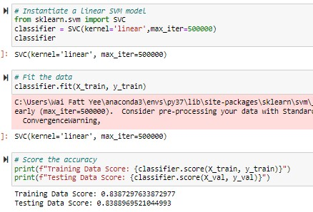
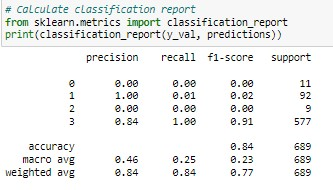
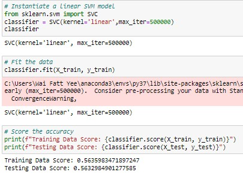
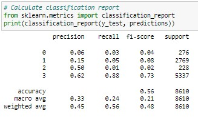
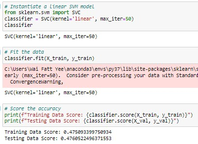
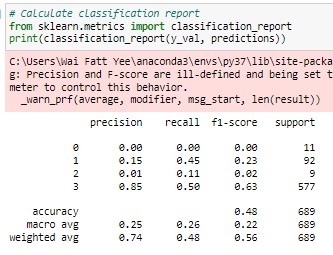
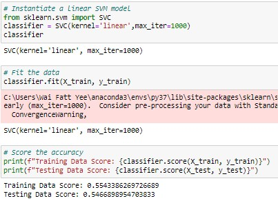
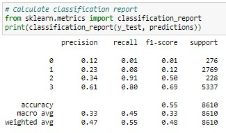

# Project-2---Predicting-Crowdfunding-Outcomes

## Support Vector Machine (SVM) Classification Model

### Parameters
* Target Vector : State (Successful, Live, Failed, Cancelled)
* Data-points : 30,992 rows x 13 columns (fairly imbalanced dataset - State is heavily skewed to 
'Successful' 19,712 rows vs 'Failed' 9,538 rows vs 'Canceled' 953 and 'Live' 789 rows)
* Validation dataset : 2,295 rows
* Train-test dataset : 28,697 rows
* SVM type: Linear

### Key Findings
* In fitting the model, we note that the number of iteration has a bearing on the prediction accuracy.
* Generally, as the number of iteration increases so does the prediction accuracy.
* However, the setback is that the model will tend to overfit i.e. it can predict accurately based on
the training data but will likely perform poorly on unseen data.
* The challenge then becomes finding the optimal training parameters that yields the best fit through trial and error.

### Comparing The Two Versions

#### Version 1
 

 

#### Version 2

 

 