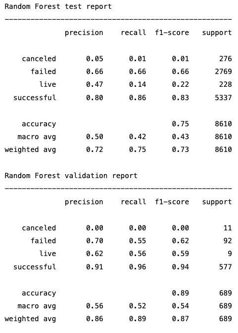
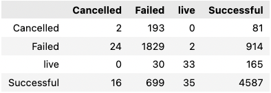

# Project-2---Predicting-Crowdfunding-Outcomes

## Data pipeline
We got the dataset from a pre-existing amazon s3 bucket, which was compiled by a web scraping service. The raw data contained a set of csv files, these files were concatenated along rows to build one large data frame. This gave us approximately 30000 data points each with more than 30 individual features. Some of the features were expressed as a JSON, these features required some extra data wrangling to unpack so that we could use them.
After the initial data processing, we began trimming the features to build a dataset that would be suitable as an input into various classification models. We also conducted some basic feature engineering, such as calculation of total active days and time to launch.
Following this, the non numerical data was encoded using sklearn's LabelEncoder, giving us a numerical dataset to feed into the models.
The now encoded data was split into a validation set and a testing set, with the validation set being from the recent market volatility of 2020. Following this, values were scaled using sklearn's StandardScaler, and train/test split was done to feed into various models.
Some things that were tested but didn't make it into the final data model included Random Over sampling to address the imbalanced dataset, removal of 'live' and 'cancelled' states from the final predictions and the testing of regressive models as a predictor of funding amount.

## Support Vector Machine (SVM) Classification Model

### Parameters
* Target Vector : State (Successful, Live, Failed, Cancelled)
* Data-points : 30,992 rows x 13 columns (fairly imbalanced dataset - State is heavily skewed to 
'Successful' 19,712 rows vs 'Failed' 9,538 rows vs 'Canceled' 953 and 'Live' 789 rows)
* Validation dataset : 2,295 rows
* Train-test dataset : 28,697 rows
* SVM type: Linear

### Key Findings
* In fitting the model, we note that the number of iteration has a bearing on the prediction accuracy.
* Generally, as the number of iteration increases so does the prediction accuracy.
* However, the setback is that the model will tend to overfit i.e. it can predict accurately based on
the training data but will likely perform poorly on unseen data.
* The challenge then becomes finding the optimal training parameters that yields the best fit through trial and error.

### Comparing The Two Versions

#### Version 1
 

 

#### Version 2

 

 

---
## Random Forest Classifier

### Features

Most important features appear to be relativly evenly split, the results are not heavily skewed by the value of any one feature.

### Classification report

The smaller validation set appeared to have a higher accuracy than the training/testing set. This is possibly due to the skewness of the data and a tendency for the model to overfit when using a smaller data set. Implementing an over/undersampling step may alleviate these problems.

### Confusion Matrix
It is also evident that the model is incapable of accuratly predicting the lesser known states, the poor precision/recal of the 'cancelled' state is due to the model often confusing this state with a failed state.

